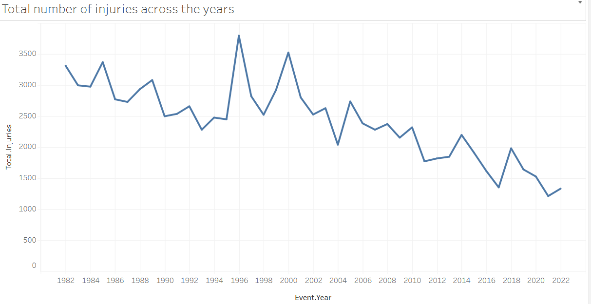
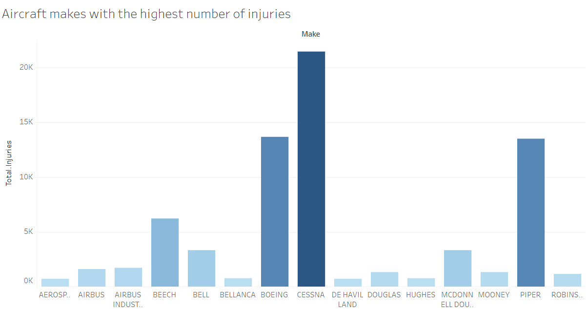
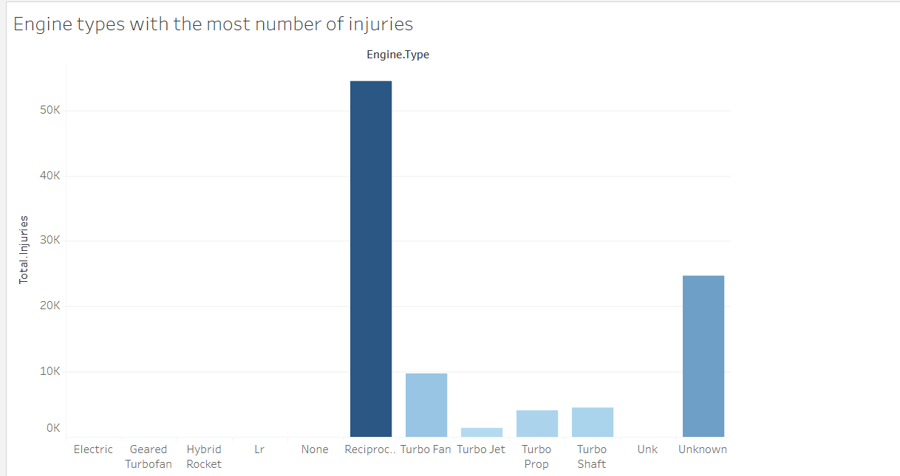

**Aviation Accident Risk Analysis**
📌**Project Overview**

This project analyzes historical aviation accident data (1962–2023) to identify patterns, trends, and risk factors that can inform business decisions. The goal is to support a company expanding into aviation by determining which aircraft categories and types present the lowest operational risk.

**Business Understanding**

This company is planning to expand into the aviation industry by purchasing and operating airplanes for both commercial and private enterprises.  
However, the leadership team does not yet have expertise in aviation safety and needs guidance on which types of aircraft present the lowest operational risks.  

This project uses historical aviation accident data (1962–2023) to answer key business questions:
- Which types of aircraft have been most frequently involved in accidents?  
- How do accident outcomes (fatal vs non-fatal) differ across categories and engine types?  
- Which phases of flight (takeoff, landing, cruise) are riskiest?  
- What role do weather conditions play in accident severity?  

By addressing these questions, we can provide actionable insights to help the aviation division make data-driven purchasing decisions, reducing both safety risks and financial exposure.

**Objectives**

Investigate accident trends over time.

Compare fatal vs. non-fatal accident outcomes.

Analyze accidents by aircraft category, make, and model.

Assess accident severity by engine type.

Provide data-driven recommendations for safer aircraft investment.

 **Dataset**

Source: National Transportation Safety Board (NTSB)
Records: Civil aviation accidents and selected incidents (1962–2023).

Cleaned dataset: cleaned_airline_accidents.csv

**Data Cleaning Steps**

Inspected dataset structure and missing values.

Standardized column names and formats.

Converted dates to proper datetime objects.

Filled or dropped missing values appropriately.

Removed duplicates.

Selected relevant columns.

Created derived fields (e.g., severity index, fatality rate).

Exported cleaned dataset for analysis.

**Visualizations**

The analysis includes:

Injuries over time (line chart)

Injuries by aircraft make (bar chart)

Injuries by engine type (bar chart)

**Key Insights**

Accident frequency has declined over time, showing improved safety.

General aviation (small piston aircraft) dominates accident records.

Modern commercial jets appear far less frequently in injury records.

These makes (Cessna, Piper, Beechcraft) account for the highest number of accidents.These manufacturers appear most often in accident records. Boeing and Airbus appear far less frequently

 **Recommendations**

Prioritize modern commercial jets instead of older piston aircraft.

Invest in multi-engine aircraft for redundancy and safety.

Adopt newer-generation fleets that benefit from recent safety advancements.

**Interactive Dashboard**

Below is my link to my tableau dashboard
https://public.tableau.com/authoring/Phase1_project_17594772285770/Dashboard1#2